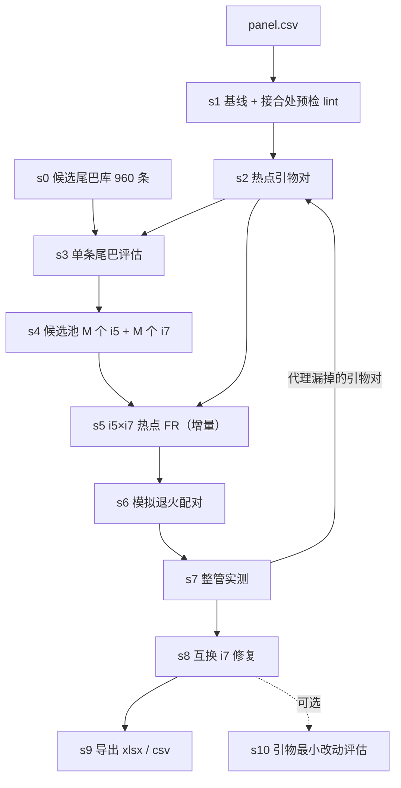

# udp_designer：为多重 PCR 引物 panel 挑选内联 UDP（i5 / i7）

给一个引物 panel，设计一套 **10 nt 内联双端唯一索引（UDP）**：i5 加在所有正向引物的 5′端，i7 加在所有反向引物的 5′端，
支持 48 或 96（可改）个样品在同一管内扩增后再按 UDP 拆分。评价对象是**同一管内**“尾巴 + 特异部分”整条引物之间的
二聚体（全局和 3′端），不评估管与管之间，也不含接头。

> 这套代码是把 33 条寡核苷酸的 6 扩增子 16S panel 上做过的流程整理成通用版本。
> 在那个 panel 上得到的结果见第 7 节。**所有等级（A / B / C）都是计算机上的热力学分级，没有任何扩增或测序实验验证**，
> 阈值是经验值（第 5 节）。换到 200 对引物的 panel 之前请先读第 8 节。

---

## 1. 核心思路

1. **i5 只影响正向引物之间的相互作用，i7 只影响反向引物之间，真正依赖“谁和谁配对”的只有 i5 × i7 的正反向相互作用。**
   所以先分别评估每条尾巴，再从候选里挑出一个池，最后才算 i5 × i7 的组合，不用一开始就算所有“尾巴对尾巴”。
2. **每周期配色、编辑距离、反向互补只取决于 i5 集合和 i7 集合，和谁配谁无关。** 所以“先选集合、再配对”，之后还可以在同组内互换 i7 来修复个别坏管，而不破坏任何序列约束。
3. **热点引物对**：绝大多数引物对加尾巴后依然没有问题，只对少数“热点”引物名对精确计算，计算量降一到两个数量级。
4. **热点只是代理，会漏**（在 33 条 panel 上第一轮预测 66A、整管实测 61A；冒烟测试里第一轮一致率只有 50%）。
   所以最后一定要**整管实测**，把代理漏掉的引物对补回热点，增量重算，循环几轮。
5. **接合处预检（lint）**：如果引物 X 的 3′端与引物 Y 的 5′端跨“尾巴交界处”互补，不带尾巴时几乎没有相互作用，加尾巴后尾巴末位补上一个配对，就会出问题。
   在 33 条 panel 上，一对这样的引物（`16S-A2-R.1` × `16S-A6-F.2`）造成了 33 个 B 管中的 20 个。这个检查几秒就能做，建议在订购引物之前就做（第 8 节）。



---

## 2. 安装与输入

```bash
pip install -r requirements.txt        # numpy, primer3-py, rapidfuzz, openpyxl
```

**panel.csv**（UTF-8，表头固定）：

| 列 | 说明 |
|---|---|
| `name` | 寡核苷酸名，唯一 |
| `site` | 位点名（同一位点可有多条主引物 / 补充引物），仅用于导出 |
| `orient` | `F` 或 `R`（缺省取 `site` 最后一个字符） |
| `seq` | 5′→3′ 序列，**允许 IUPAC 简并碱基**，导出时保留简并符号，评估时展开成全部非简并序列 |

示例：`examples/panel_33.csv`（本项目的 33 条 panel）。`examples/panel_synthetic_200.csv` 是随机生成的 200 对，**只用来测速**，不能用来设计。

**config.json**（只写要改的项，其余用默认，见 `examples/config_example.json`）：

| 项 | 默认 | 含义 |
|---|---|---|
| `thermo` | 58 °C，50 mM Na⁺，2 mM Mg²⁺，0.2 mM dNTP，250 nM | primer3 参数，改成你的退火条件 |
| `tier` | A: H≥−7 且 E≥−4.5；B: H≥−8.5 且 E≥−5.5 | H=全局异源二聚体最差 ΔG，E=3′端锚定最差 ΔG（kcal/mol）；`auto: true` 时若无尾巴基线已比 A 阈值差，阈值按基线放宽 |
| `tail` | 10 nt，GC 4–6，两两编辑距离 ≥4，跨类反向互补 ≥3 | 尾巴长度和序列规则 |
| `per_cycle` | 各周期 GC、A+C、A+T 占 40–60%，A/C/G/T 各 ≥15% | Illumina 两通道平台 index 读段的颜色平衡；只用 ONT 可以放宽 |
| `universe.n_each` | 480 | 候选尾巴库每类条数（共 2×） |
| `pool.n_each` | 144 | 候选池每类条数 M（**s5 的计算量 ∝ M²**） |
| `pairs.n_pairs / n_core` | 96 / 48 | 要选几对；前 `n_core` 对是核心子集（自己也满足每周期配色），设 0 则不用 |
| `hot` | 基线余量 2.5 / 2.0 kcal，lint k≥5 | 热点判据 |
| `procs` | CPU 核数 | 并行进程数 |

---

## 3. 快速开始

```bash
cd udp_designer
# 冒烟测试（33 条 panel，16 对，约 40 分钟，4 核）
./run_all.sh /tmp/w examples/panel_33.csv examples/config_smoke.json 3

# 正式运行（默认 96 对；现有条形码清单用于避开，可选）
./run_all.sh work/ my_panel.csv my_config.json 4 existing_barcodes.txt
```

`run_all.sh <工作目录> <panel.csv> [config.json] [最多几轮=3] [现有条形码.txt]`：
s0 → s1 →（每轮：s2 → s3 → s4 → s5 → s6 → s7）→ s8 → s9。一轮里实测没有漏掉的引物对并且没有 C 级就提前结束。
**所有步骤都可断点续算，掉线后原命令重跑即可**（沙箱、集群被回收都不怕）。

分步运行时每个脚本都是 `python3 sN_xxx.py --work W --panel panel.csv [--cfg config.json]`。

---

## 4. 每一步做什么

| 步骤 | 输入 → 输出 | 说明 | 计算量（N=展开引物数，M=候选池大小） |
|---|---|---|---|
| `s0_universe.py` | → `universe.tsv` | 枚举 4¹⁰ 条序列，按单条规则筛（GC、同聚物 ≥3、二核苷酸重复 ≥3 次、GGGG、前两位不是 GG、不含接头 6-mer、非回文、避开现有名单），贪心取两类各 `n_each` 条：类内两两编辑距离 ≥4，两类之间 x 对 rc(y) ≥3 | 几秒 |
| `s1_baseline.py` | panel → `baseline.npz`、`thresholds.json`、`lint.tsv` | 不带尾巴的全部展开引物两两二聚体；自动阈值；接合处互补预检 | 1.5·N² 次 primer3 调用 |
| `s2_hotpairs.py` | → `hot_pairs.json` | 基线接近阈值的引物名对 + lint 命中 + `hot_extra.json`（s7 补回的） | 秒 |
| `s3_single.py` | → `single.pkl` | 每条尾巴按 i5 角色（加在正向）和 i7 角色（加在反向）对热点引物对算 FF / RR / FRu / RFu 和发夹，另算“尾巴本身 × 全部引物”的代理。**增量**：新增热点对只补算新增部分 | 约 960 × (3·热点对数·展开² + 3N) |
| `s4_pool.py` | → `pool.json` | 模拟退火选 M 个 i5 + M 个 i7：硬约束（编辑距离、跨类反向互补、每周期配色）+ 单条代价 | 分钟 |
| `s5_fr.py` | → `fr_*of*.pkl` | 候选池里每个 i5 × 每个 i7 的正向×反向热点相互作用；越差越早终止；**增量**；`--shard k/n` 多机并行 | **M² × 热点 F×R 对数 × 展开乘积 × 3 次调用，是最贵的一步** |
| `s6_pair.py` | → `pairs_rK.json` | 模拟退火选 n_pairs 对并配对；`--meas` 用累积实测覆盖预测；`--ban5 / --ban7` 禁用序列 | 分钟 |
| `s7_tubes.py` | → `tubes_<tag>/`、`meas.json`、`hot_extra.json` | **整管实测**：加尾巴后全部展开引物两两（含自身）的 H 与 E，取最差分级；复用此前已测过的相同管；把“实测比预测差”的管里最差的引物名对补回热点 | 每管 1.5·N²，× n_pairs |
| `s8_repair.py` | → `pairs_repaired.json` | 对 ≥ `--target` 的管，在同组里互换 i7，整管实测互换后的两个管，挑总代价下降的；修不好的会提示 `--ban5/--ban7` | 每个坏管 `--trials`×2 个管 |
| `s9_export.py` | → `out/udp_<N>pairs.xlsx`、`..._full_oligos.csv` | 全部 n_pairs 对和核心 n_core 对两套：序列、整管实测等级、每周期统计（Excel 公式）、独立验证（编辑距离、反向互补、配色、同聚物、与现有名单是否相同）；csv 是 n_pairs×寡核苷酸数 条完整引物 | 秒 |
| `s10_tweak.py` | 可选 | 对某条引物做最小改动（3′ / 5′端修剪、3′端最后几位替换）后重算热力学，用于“上了 UDP 才发现两条引物互补，能不能微调” | 筛选模式：伙伴数 × 变体；整管模式：同 s7 |

分级：`A`：H ≥ `A_H` 且 E ≥ `A_E`；`B`：H ≥ `B_H` 且 E ≥ `B_E`；否则 `C`。每个管取全部引物对中最差的 H 和最差的 E。

---

## 5. 结果怎么看，什么算成功

- `out/udp_<N>pairs.xlsx` 的“说明”页：整管实测 A / B / C 计数；独立验证行必须是：最小编辑距离 ≥4、跨类反向互补 ≥3、每周期全部达标 = True、同聚物 0、与现有名单相同 0。**任何一项不满足就不要订购。**
- 等级是**整管实测**的，不是预测。看 `tubes_<tag>.summary.json` 里每轮的“预测 / 实测一致率”和“漏掉的引物对”：几轮后漏掉的对应该趋近 0。
- 阈值是经验值，没有文献或实验标定；不同 panel 的“无尾巴基线”差别很大。`s1` 会告诉你基线最差值，若基线本身已比 A 阈值差，`auto` 会放宽阈值，此时“A 级”表示“相对基线几乎没变坏”，不是绝对的好。
- **A 级多不等于测序产量均匀**。建议先做同一样品、多条形码的小对照（第 9 节）。

---

## 6. 从本项目学到的经验

1. **预测一直比实测乐观。** 33 条 panel 上三轮的预测 A 数是 69 / 66 / 66，对应整管实测 55 / 61 / 63。冒烟测试（16 对）第一轮预测 10A / 6B / 0C，实测 3A / 8B / 5C。不要把预测当结果。
2. **C 是局部问题。** 每个 C 管通常由一两个具体的引物对造成。互换同组 i7 或整条禁用一个 i7 就能修好大部分；修不好说明问题在引物本身。
3. **“没有 C 了”是在同一套指标上反复挑出来的**，不是方法保证。没有用独立指标验证过。
4. **A 级的上限常常由引物设计决定，而不是 UDP。** 33 条 panel 里 33 个 B 管有 25 个是 3′端稳定性不够，其中 20 个来自同一对引物；只把这一对的相互作用去掉，A 就能从 63 升到 81。换更多 UDP 只能把 A 从 61 提到 63。
5. **我试过并否决的提速办法**：用“最长连续互补段 ≥5”预筛引物对，只对通过的对算热力学。在 33 条 panel 的基线上检验，ΔG ≤ −5 的 79 对里有 36 对最长连续互补段只有 4（primer3 会用带错配 / 环的比对），这个筛法会漏掉真正的坏对，所以**没有采用**。
6. **改引物要连带评估覆盖率和脱靶，且改 3′种子区必须全基因组重扫。** 旧的命中列表只记录 3′端 8 nt 完全匹配的位点，3′端修剪后会低估脱靶（33 条 panel 上 3′端修剪 1 nt，人基因组 ≤2 错配位点实际从 28 变成 55，旧列表显示不变）。
7. 在 Illumina 两通道平台上，index 读段要求每个周期颜色平衡；上面的 `per_cycle` 约束只针对这一点，与 ONT 无关。

---

## 7. 在 33 条 panel 上的结果（供参考）

panel：33 条寡核苷酸，198 条展开引物（60 正向、138 反向），58 °C。候选 960 条、候选池 144 × 144、选 96 对（核心 48 对）。

| 方案 | 96 对 A / B / C | 核心 48 对 A / B / C |
|---|---|---|
| Illumina 371 对原配对（未挑选） | 86 / 126 / 159 | — |
| 自建 UDP，原引物池（默认） | 63 / 33 / 0 | 33 / 15 / 0 |
| 自建 UDP，只改一条引物的一个碱基 | 80 / 16 / 0 | 38 / 10 / 0 |

三轮的预测 / 实测：69/27/0 → 55/38/3；66/30/0 → 61/33/2（互换后 61/34/1）；66/30/0 → 63/31/2（互换后 63/33/0）。
这些数字来自 `python_5R/explore/udp960_*.py`（探索版，路径写死、依赖会话临时目录），`udp_designer` 是整理后的通用版本，
随机种子和增量循环不同，复跑不会得到完全相同的序列，但流程和判据一致。

**冒烟测试**（16 对，候选只有 100+100 条、池 36×36，故意设得很小，用来检查代码能跑通）：

| 轮次 | 预测 A / B / C | 实测 A / B / C | 预测与实测一致率 | 漏掉的引物对 |
|---|---|---|---|---|
| 第 1 轮 | 10 / 6 / 0 | 3 / 8 / 5 | 0.50 | 11 |
| 第 2 轮 | 7 / 7 / 2 | 6 / 7 / 3 | 0.94 | 1 |
| 第 3 轮 | 10 / 5 / 1 | 8 / 6 / 2 | 0.81 | 2 |
| 互换修复后 | — | 9 / 5 / 2 | — | — |

（第 2、3 轮的预测里已经包含第 1、2 轮实测过的组合，所以一致率比第 1 轮高，不是代理本身变准了。）

规模这么小时 3 轮没有把 C 降到 0，这是候选池太小的结果，不代表正式规模；它说明**循环需要足够的轮数和足够大的候选池**。

---

## 8. 换成 200 对引物的 panel：规模、风险和建议

### 8.1 先看规模

计算量的主要变量是展开引物数 **N**（每个简并位置翻倍）。200 对 = 400 条寡核苷酸，若平均每条 6 个展开，N ≈ 2400，是 33 条 panel（N=198）的 12 倍，
**所有“两两”类步骤的计算量 ∝ N²，约 150 倍**。用 `estimate_cost.py` 按本机实测速度估算：

```bash
python3 estimate_cost.py my_panel.csv --pairs 96 --pool 144 --cores 32
# s2 跑完后，用真实热点数替换估计值：  --hot-pairs $(python3 -c "import json;print(len(json.load(open('work/hot_pairs.json'))['hot']))")
```

SYN200_BLOCK

### 8.2 建议（按优先级）

1. **订购引物之前先做体检（s1 + s2，分钟到小时）。** 看三件事：
   - `thresholds.json`：无尾巴基线最差 ΔG。panel 越大，最差的那一对越差（极值统计），基线可能已经比 −7 / −4.5 差。此时 `auto` 会放宽阈值，但要明白“A 级”的含义已经变了。
   - `lint.tsv`：跨尾巴交界处互补的引物对。33 条 panel 里 12 对，其中 1 对造成了 60% 的 B 管。200 对 panel 里会有几十到上百对。
   - `hot_pairs.json` 的数量：它决定 s3、s5 的成本。
2. **把 lint 变成引物设计约束，而不是事后补救。** 在选引物（或调整引物起点 ±1–2 nt）时，拒绝“X 的 3′端 5–6 nt 的反向互补 = Y 的 5′端前 5 nt”的组合。这比事后改引物的 3′ / 5′端便宜得多（见第 6 条经验：改 3′端会让脱靶翻倍）。
3. **控制展开数。** N 每翻一倍，二聚体对数翻 4 倍，所有步骤的耗时也翻 4 倍。优先减少简并位置；确实要简并，改用把一个多简并引物拆成两条低简并引物的方案时，先看 `estimate_cost.py` 的变化。
4. **考虑把 200 对分成 2–4 个子池（每个 50–100 对）。** 子池之间互不影响，每个子池独立走一遍流程，同一样品的每个子池加**同一对 UDP**即可（合并上机后按 UDP 拆样品，再按扩增子序列区分子池）。
   二聚体对数 ∝ N²，分成 k 个子池后总计算量约降到 1/k，同时每个子池的最差二聚体也会好很多。代价是每个样品要做 k 个反应。
5. **缩小候选池。** s5 ∝ M²。96 对时 M 可以从 144 降到 64–96（留 1.3–1.6 倍冗余），耗时降到约 1/4–1/2。先用小的 M 跑一轮，看 A 率再决定要不要放大。
6. **s5 用多机分片**（`--shard k/n`），s7 的管天然独立（`--shard`）。s7 每轮会自动复用没变的管，所以后几轮的成本远低于第一轮。
7. **轮数：预期 3–5 轮。** 判断标准是“每轮漏掉的引物对数量”：它降到 0 附近才说明热点集合收敛了。轮数不够，最后的 C / B 管里还是代理的盲区。
8. **A 级比例会低于 33 条 panel 的水平。** 同样的阈值下，panel 越大，一个管里至少有一对差的概率越大。建议在 `s1` 的自动阈值之外，再看两个次要指标：每个管里低于 A 阈值的展开引物对**条数**（一对差和一百对差不一样），以及按浓度加权的二聚体负荷。这两个指标当前代码没有实现，只给出 `PH / PE`（每管每个引物名对的最差值，存在 `tubes_*/T*.pkl`）作为原料。
9. **UDP 的数量和 panel 大小无关。** 96 对 UDP 要同时对 400 条引物友好，所以单条尾巴被淘汰的比例会更高；universe 只要够大（默认 960 条已经很宽裕，s0 只要几秒），不需要扩。
10. **仍然按“先小后大”验证。** 先用 `pairs.n_pairs=24`、`pool.n_each=48` 在 200 对 panel 上走通一遍，看 A / B / C 比例和每轮一致率，再决定放大到 96 对。
11. **最终必须做实验验证。** 同一样品、多个不同 UDP；电泳或片段分析检查 40–60 bp 的引物二聚体；再看各扩增子的读数是否均衡。

### 8.3 没有实现、但值得考虑的

- 把“尾巴末位碱基”作为 universe 规则（让它不与 panel 里任何引物 5′端前几位互补）：能从源头减少接合处互补，但会减小 universe。目前未实现。
- 对热点对用“只算最差的几个展开组合”代替全部展开乘积：能再降几倍计算量，但会引入近似；需要像热点一样做一致率验证。目前未实现。
- 覆盖率和基因组脱靶：本代码**不含**。改引物（s10）后必须用你自己的参考序列库重算覆盖率（口径：≤1 错配且 3′端 3 nt 无错配），并对基因组重新全长扫描脱靶。仓库里 `python_5R/explore/udp_primer_tweak*.py` 有我们当时的做法。

---

## 9. 局限

- **没有任何实验验证。** A / B / C 是 primer3 热力学的计算机分级，阈值是经验值。
- 评价的是**同一管内**的引物；不含接头，不含模板，不含聚合酶偏好，不含管与管之间的串扰（index hopping 等）。
- 整管实测是最终判据，但仍是单一指标；**在同一指标上反复挑选**会让最终结果偏乐观，没有独立指标做交叉验证。
- 热点代理必然会漏，必须靠整管实测补回；轮数不够时最终结果里会有代理的盲区。
- 与 Illumina 现成 UDP 的比较不是同条件对比：自建序列是从 960 条里挑出来的，并且只对 i5 与 rc(i7) 放宽到 ≥3；Illumina 的序列有长期实测积累，自建序列没有。
- 如果需要避开某家的现成条形码序列，用 `--exclude` 传入清单（含反向互补一起避开）。

## 10. 目录

```
udp_designer/
  README.md  requirements.txt  run_all.sh
  udp_common.py              公共函数（配置、panel、热力学、等级、尾巴规则、每周期配色）
  s0_universe.py … s10_tweak.py   各步骤
  make_synthetic_panel.py    随机合成 panel（只用于测速）
  estimate_cost.py           按本机速度估算耗时
  examples/                  panel_33.csv  panel_synthetic_200.csv  config_example.json  config_smoke.json
```
